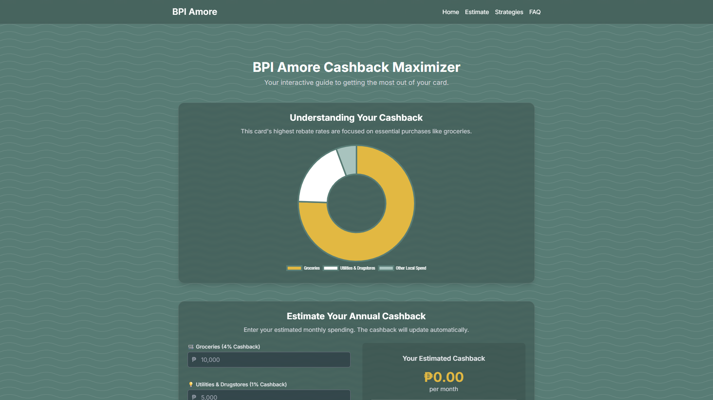

# BPI Amore Cashback Maximizer

An interactive, single-page React application designed to help users of the BPI Amore Cashback credit card understand its mechanics and estimate their potential annual cashback.



**Live Demo:** [https://bpi-cash-back-maximizer.vercel.app/](bpi-cash-back-maximizer.vercel.app/)

---

## ✨ Features

- **Interactive Cashback Calculator:** Dynamically estimates monthly and annual cashback based on user spending in different categories (groceries, utilities, etc.).
- **Animated Results:** Cashback totals animate smoothly as input values change.
- **Visual Cashback Breakdown:** A Doughnut chart visualizes the cashback rates for different spending categories.
- **Maximization Strategies:** A tabbed section outlines the core rules, pro tips, and common pitfalls associated with the card.
- **Responsive Design:** A mobile-first design that ensures a seamless experience on desktops, tablets, and smartphones.
- **Glassmorphism UI:** A modern, glassy aesthetic for the navigation and key components.
- **Smooth Scrolling & Animations:** Subtle animations on scroll and smooth navigation between sections enhance the user experience.
- **Comprehensive FAQ:** An accordion-style FAQ section answers common questions about the card.
- **Legal Disclaimer:** A clear disclaimer regarding the app's purpose and non-affiliation with BPI.

---

## 🛠️ Tech Stack

- **Frontend:** [React](https://reactjs.org/)
- **Styling:** [Tailwind CSS](https://tailwindcss.com/) for utility-first styling & custom CSS for effects.
- **Charts:** [Chart.js](https://www.chartjs.org/) with [react-chartjs-2](https://react-chartjs-2.js.org/) for data visualization.
- **Animations:**
  - [Framer Motion](https://www.framer.com/motion/) (or `react-transition-group`) for component transitions.
  - [Intersection Observer API](https://developer.mozilla.org/en-US/docs/Web/API/Intersection_Observer_API) for scroll-based animations.
- **Deployment:** Hosted on [Vercel](https://vercel.com/), [Netlify](https://www.netlify.com/), or [GitHub Pages](https://pages.github.com/).

---

## 🚀 Getting Started

To get a local copy up and running, follow these simple steps.

### Prerequisites

You need to have [Node.js](https://nodejs.org/) (version 14 or later) and [npm](https://www.npmjs.com/) installed on your machine.

### Installation

1. **Clone the repository:**

   ```sh
   git clone https://github.com/your-username/bpi-cashback-maximizer.git
   ```

2. **Navigate to the project directory:**

   ```sh
   cd bpi-cashback-maximizer
   ```

3. **Install NPM packages:**

   ```sh
   npm install
   ```

### Running the App

To run the app in development mode:

```sh
npm start
```

Open [http://localhost:3000](http://localhost:3000) to view it in your browser. The page will automatically reload when you make changes.

---

## 📜 Disclaimer

This application is for educational and informational purposes only. It is not affiliated with, endorsed by, or in any way officially connected with the Bank of the Philippine Islands (BPI). The calculations are estimates and should not be considered financial advice. Always refer to the official BPI website for the most accurate and up-to-date information.

---

## 📄 License

This project is licensed under the MIT License. See the `LICENSE` file for more details.

---

## Acknowledgments

- Project inspired by the need for a clearer understanding of credit card reward systems.
- Built with [Create React App](https://github.com/facebook/create-react-app).
